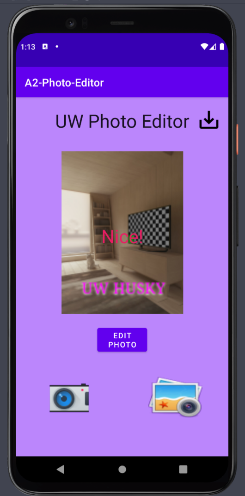
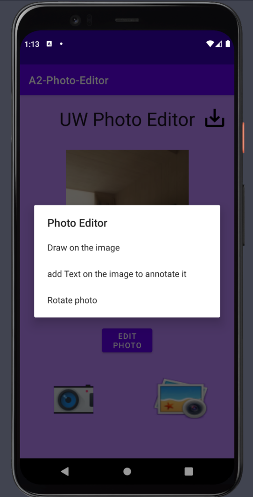

See the [requirements in requirements.md](requirements.md) or on Canvas. 

When you are ready, edit this file with the following info: 

# A2: Photo Editor \[Jeremy Cao\]

## Overview

I built a simple photo editor! It can add text to the photo and rotate the photo with 90 degrees.

## Using the app 

User is able to use either CameraX to take a photo or insert a photo from the gallery then have two simple functions to edit the photo. Once finish editing, user
is able save the photo to the phone gallery.

## Walkthrough

Screenshots:

## Reflection/Summary

To Do:
- Figure out the way to translate the bitMap x y coordinates
- Integrate the draw on image feature

